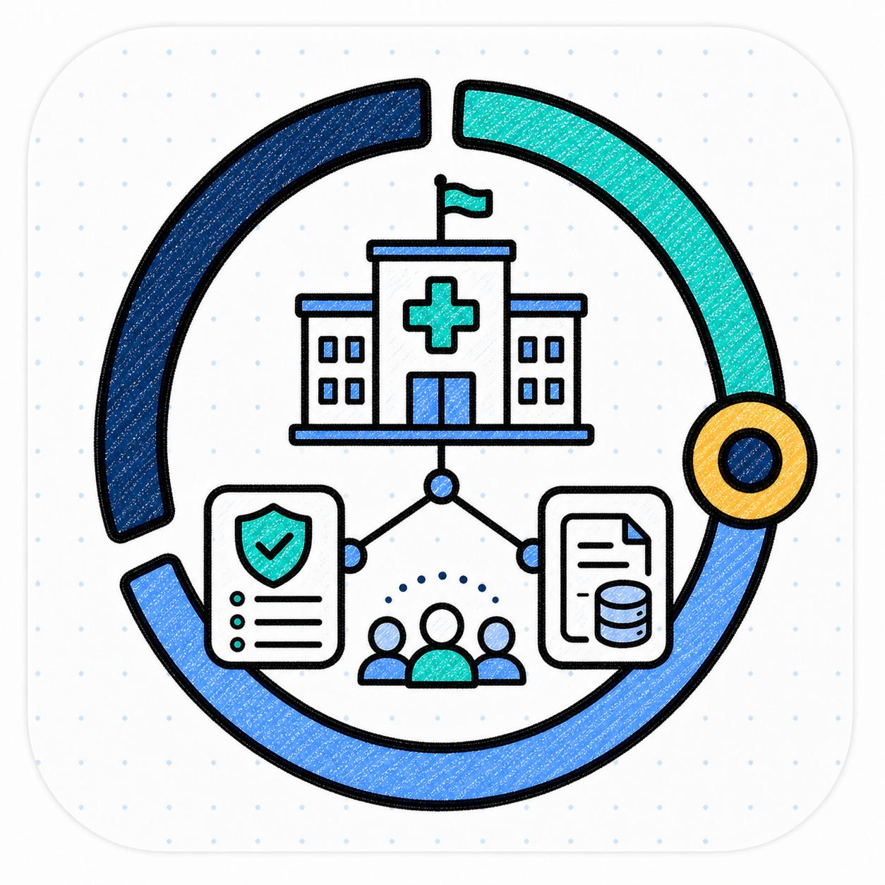
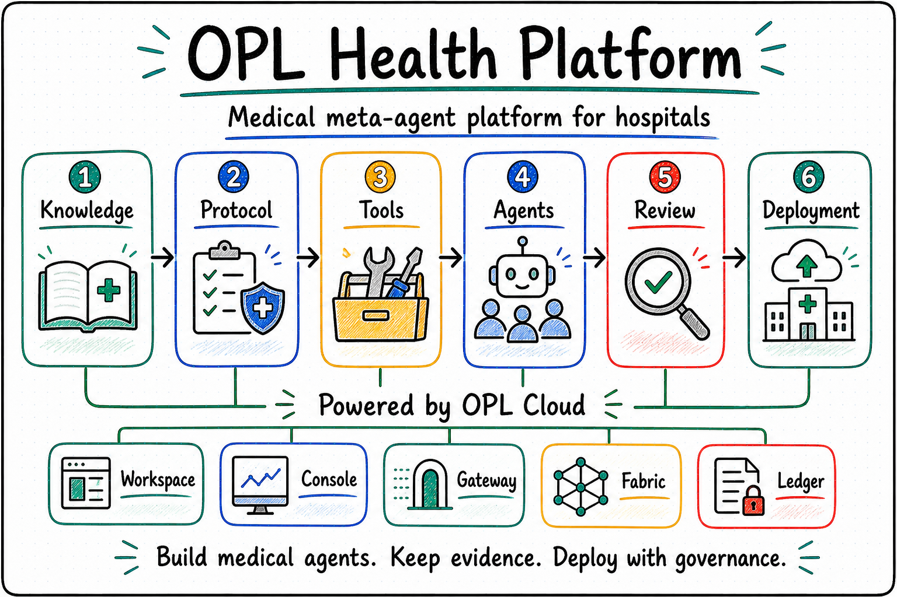

<p align="center">
  
</p>

<p align="center">
  <a href="./README.md"><strong>English</strong></a> | <a href="./README.zh-CN.md">中文</a>
</p>

<h1 align="center">OPL Health Platform</h1>

<p align="center"><strong>A medical meta-agent platform for hospitals</strong></p>
<p align="center">Medical knowledge · clinical rules · medical tools · specialty agents · review and delivery</p>

<!--
Owner: `opl-health-platform`
Purpose: `public_health_platform_entry`
State: `planning_public_entry`
Machine boundary: Human-readable product and planning entry. Machine truth for generic cloud capabilities, workspace runtime, console, resource scheduling, model access, evidence records, and operational status remains with OPL Cloud, owning implementation repositories, services, contracts, runtime outputs, and owner receipts.
-->

## Why OPL Health Platform

Hospitals need AI systems that go beyond one-off answers or a single chatbot.
They need medical agent systems that can work across real clinical, research,
quality, and operational workflows.

Those systems must handle medical knowledge, clinical rules, hospital data,
specialty workflows, tool use, review records, and deliverable outputs:

- Clinicians need agents that understand specialty context, clinical rules, and
  patient-data boundaries.
- Departments need reusable disease workflows, research processes, and quality
  requirements.
- Hospitals need private, dedicated, or hybrid deployment options that fit local
  data and compute boundaries.
- Management teams need permissions, audit records, usage, risk control, and
  traceable output provenance.
- AI teams need one governed way to develop, test, publish, and operate medical
  agents.

**OPL Health Platform is built as that medical meta-agent platform for hospitals.**

It turns OPL Cloud's general AI infrastructure into a healthcare product layer:
medical knowledge packs, clinical rule packs, medical tool packs, specialty
templates, medical reviewer gates, and hospital deployment models on top of a
shared workspace, console, resource substrate, and evidence record.

## Product Positioning

OPL Health Platform is the healthcare product-line entry for OPL.

| Layer | Name | Role |
| --- | --- | --- |
| Healthcare brand line | **OPL Health** | OPL product family for medical institutions |
| Hospital platform | **OPL Health Platform** | Medical meta-agent platform for hospitals |
| Agent building | **OPL Health Studio** | Development and configuration of medical agents, specialty workflows, knowledge packs, and rule packs |
| Medical integration | **OPL Health Connect** | HIS, EMR, LIS, PACS, literature, database, and hospital tool connections |
| Scenario products | **OPL Health Apps** | Specialty agents, research assistants, quality assistants, follow-up assistants, management assistants |
| Technical substrate | **Powered by OPL Cloud** | Workspace, console, resources, model access, metering, and evidence capabilities |

The first phase defines the platform, boundaries, capability packs, and minimum
delivery path. Studio, Connect, and Apps can become separate product surfaces as
real hospital scenarios mature.

The repository boundary is intentionally thin in this phase. The machine-readable
boundary is [`contracts/opl-health-platform-boundary.json`](contracts/opl-health-platform-boundary.json):
Health owns medical product requirements, capability packs, review policy, and
deployment models; it consumes OPL Cloud / App / Framework refs and receipts
without owning runtime, resource scheduling, billing, model access, evidence
storage, release currentness, or clinical decision authority.

<p align="center">
  
</p>

## Core Capabilities

**OPL Health Agents**<br/>
Governed medical agents for specialty disease workflows, research, quality
control, follow-up, record organization, guideline matching, evidence review,
and operational processes.

**OPL Health Knowledge**<br/>
Guidelines, consensus documents, textbooks, literature, hospital policies,
department material, and project material with source, version, scope, and
update records.

**OPL Health Protocol**<br/>
Reusable clinical pathways, quality indicators, inclusion and exclusion
criteria, risk stratification rules, follow-up rules, and review requirements.

**OPL Health Tools**<br/>
Hospital systems, databases, literature sources, statistical analysis, charting,
report generation, and research tools.

**Specialty templates**<br/>
Task templates, data requirements, review standards, result formats, and
delivery paths for high-value specialty scenarios.

**OPL Health Review**<br/>
Input provenance, execution traces, tool calls, reviewer results, owners, and
continuation entries for important tasks.

**OPL Health Deployment**<br/>
Private, dedicated, and hybrid deployments aligned with hospital security,
permissions, data, and compute boundaries.

## Relationship With OPL Cloud

OPL Health Platform is not a second cloud platform. It is the healthcare product
layer built on OPL Cloud.

```text
OPL Health Platform
├─ Medical knowledge packs
├─ Clinical rule packs
├─ Medical tool packs
├─ Specialty templates
├─ Medical reviewer gates
└─ Hospital deployment models

Powered by OPL Cloud
├─ OPL Gateway    model access, keys, routing, usage
├─ OPL Workspace  online workspaces and task sessions
├─ OPL Console    users, permissions, resources, billing, audit
├─ OPL Fabric     compute, storage, environments, connectors, agent registry
└─ OPL Ledger     job receipts, artifact provenance, review records, continuation refs
```

OPL Cloud provides the generic substrate. OPL Health Platform provides the
medical industry layer and hospital product experience.

## Documentation

- [Product Positioning](docs/product-positioning.md)
- [Target Operating Model](docs/target-operating-model.md)
- [Architecture](docs/architecture.md)
- [OPL Cloud Capability Usage](docs/opl-cloud-capability-usage.md)
- [Scenario Map](docs/scenario-map.md)
- [Specialty Research Assistant](docs/scenarios/specialty-research-assistant.md)
- [Specialty Quality Assistant](docs/scenarios/specialty-quality-assistant.md)
- [Follow-up Assistant](docs/scenarios/follow-up-assistant.md)
- [Medical Capability Packs](docs/medical-capability-packs.md)
- [OPL Health Knowledge](docs/opl-health-knowledge.md)
- [OPL Health Protocol](docs/opl-health-protocol.md)
- [OPL Health Tools](docs/opl-health-tools.md)
- [OPL Health Agents](docs/opl-health-agents.md)
- [OPL Health Review](docs/opl-health-review.md)
- [OPL Health Deployment](docs/opl-health-deployment.md)
- [Specialty Template System](docs/specialty-template-system.md)
- [Medical Agent Lifecycle](docs/medical-agent-lifecycle.md)
- [Hospital Deployment Models](docs/hospital-deployment-models.md)
- [Compliance and Responsibility](docs/compliance-and-responsibility.md)
- [Roadmap](docs/roadmap.md)

## Current Status

This repository currently contains product planning, architecture boundaries,
and healthcare capability design. Service code, runtime environments, billing,
resource scheduling, model access, and evidence storage live in their owning
implementation surfaces.

The first phase is to make the brand, boundary, capability packs, deployment
path, and relationship with OPL Cloud explicit before pilots and implementation
work begin.
