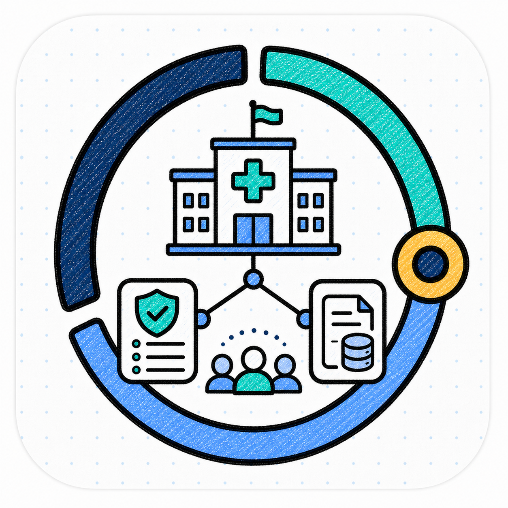
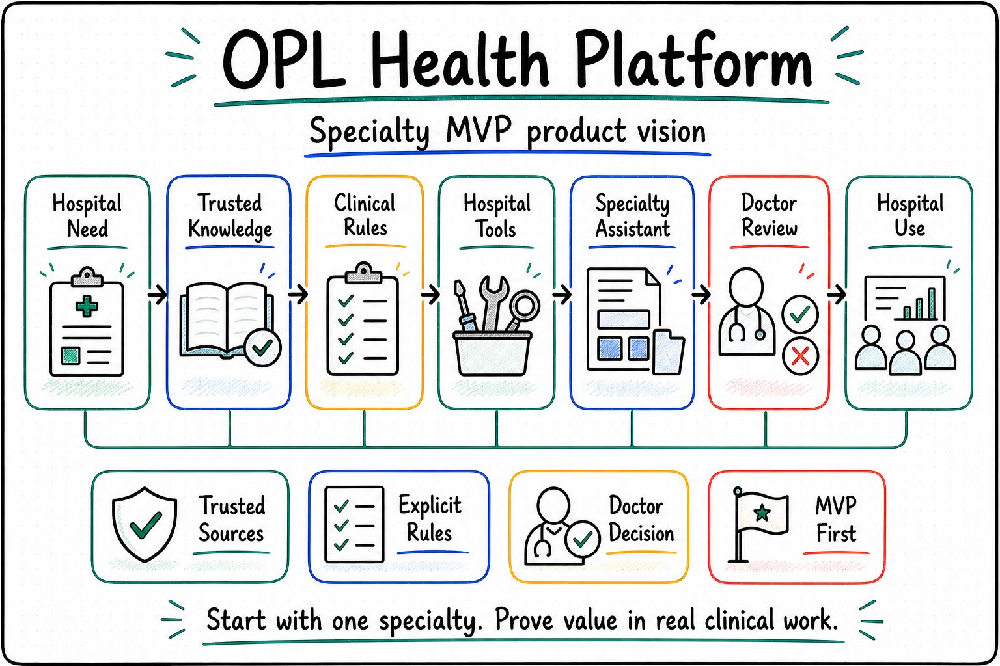

<p align="center">
  
</p>

<p align="center">
  <a href="./README.md">English</a> | <a href="./README.zh-CN.md"><strong>中文</strong></a>
</p>

<h1 align="center">OPL Health Platform</h1>

<p align="center"><strong>面向医院的医疗元智能体平台</strong></p>
<p align="center">医学知识 · 临床规则 · 医疗工具 · 专病智能体 · 审查交付</p>

<!--
Owner: `opl-health-platform`
Purpose: `public_health_platform_entry`
State: `planning_public_entry`
Machine boundary: 人读产品与规划入口。通用云能力、工作空间、控制台、资源调度、模型接入、证据记录和运行状态的机器真相，仍以 OPL Cloud、相关实现仓库、服务、合同、运行输出和负责人回执为准。
-->

## 为什么需要 OPL Health Platform

医院正在面对一类新的 AI 需求：能够围绕真实业务持续工作、沉淀专业能力、支撑审查交付的医疗智能体系统。

这类系统需要同时处理医学知识、临床规则、院内数据、专科流程、工具调用、审查记录和交付结果：

- 医生希望智能体理解专科语境、临床规则和患者资料边界。
- 科室希望把专病经验、科研流程和质控要求沉淀成可复用能力。
- 医院希望系统可以私有化部署，接入院内数据和计算资源。
- 管理团队希望看到权限、审计、用量、风险控制和结果来源。
- AI 团队希望用统一框架开发、测试、发布和治理医疗智能体。

**OPL Health Platform 面向医院建设这套医疗元智能体平台。**

它以 OPL Cloud 为确定的技术底座，把通用的工作空间、管理、资源、模型接入和证据能力延伸到医疗行业，形成医学知识包、临床规则包、医疗工具包、专病模板、医疗审查机制和医院部署方案。

## 产品定位

OPL Health Platform 是 OPL 面向医疗行业的产品线入口。

| 层级 | 名称 | 定位 |
| --- | --- | --- |
| 医疗品牌线 | **OPL Health** | 面向医疗机构的 OPL 产品族 |
| 院级主平台 | **OPL Health Platform** | 面向医院的医疗元智能体平台 |
| 智能体构建 | **OPL Health Studio** | 医疗智能体、专病流程、知识包和规则包的开发与配置 |
| 医疗系统接入 | **OPL Health Connect** | HIS、EMR、LIS、PACS、文献库、数据库和院内工具接入 |
| 场景应用集合 | **OPL Health Apps** | 专病智能体、科研助手、质控助手、随访助手和管理助手 |
| 技术底座 | **OPL Cloud** | 工作空间、控制台、资源、模型接入、计量和证据能力 |

第一阶段先建设 **OPL Health Platform**，从一个真实专病场景出发，验证医疗能力包、人工审查和医院部署路径。Studio、Connect 和 Apps 将根据真实需求逐步形成独立产品入口。

OPL Cloud 是选定的技术底座；当前可用性须从 Cloud 和部署实例仓核验。本仓库只负责医疗产品需求、能力包、审查策略和部署模型，不重复建设通用运行时、资源调度、账单、模型接入、证据存储或发布机制。医学判断和临床责任始终由医院及其指定专业人员承担。

## 当前建设边界

本仓库当前以产品和架构文档为主，优先完成一个专病最小可行试点。试点需要明确专科场景、最小知识和规则、必要工具、人工审查点、责任边界，以及需要使用的 OPL Cloud、OPL App 和 OPL Framework 能力。

医疗平台尚未进入服务实现和医院部署阶段。本阶段不新增通用云服务、账单系统、资源调度器或独立证据系统，也不把设计文档表述成已经发布、部署或通过医疗验收的产品能力。

<p align="center">
  
</p>

## 核心能力

**OPL Health Agents**<br/>
围绕专病、科研、质控、随访、病历整理、指南匹配、文献证据和管理流程建设可治理的医疗智能体。

**OPL Health Knowledge**<br/>
沉淀指南、共识、教材、文献、医院制度、科室材料和项目资料，并记录来源、版本、适用范围和更新机制。

**OPL Health Protocol**<br/>
把临床路径、质控指标、纳入排除标准、风险分层、随访规范和审查要求整理成可复用规则。

**OPL Health Tools**<br/>
接入院内系统、数据库、文献源、统计分析、图表生成、报告生成和科研工具。

**专病模板**<br/>
围绕高频专科场景提供任务模板、数据要求、审查标准、结果格式和交付路径。

**OPL Health Review**<br/>
为关键任务保留输入来源、运行过程、工具调用、审查结果、负责人和继续入口，支持复查、审计和接力。

**OPL Health Deployment**<br/>
规划院内私有化、专有云和混合部署路径，使产品适应医院的信息化、安全、权限、数据和计算资源边界。

## 与 OPL Cloud 的关系

OPL Health Platform 是建立在 OPL Cloud 之上的医疗行业产品层。

```text
OPL Health Platform
├─ 医学知识包
├─ 临床规则包
├─ 医疗工具包
├─ 专病模板
├─ 医疗审查机制
└─ 医院部署方案

OPL Cloud 技术底座
├─ OPL Gateway    模型接入、密钥、路由、用量
├─ OPL Workspace  在线工作空间和任务会话
├─ OPL Console    账户、工作空间、配额和管理入口
├─ OPL Fabric     计算、存储、环境、连接器
└─ OPL Ledger     任务回执、对账证据和来源引用
```

OPL Cloud 负责通用平台能力。OPL Health Platform 负责医疗行业能力、医学审查规则和医院产品体验。Ledger 可以保存由业务方提供的回执和来源引用，但不负责医学结论、审查决定或后续工作授权。

## 文档

- [文档索引](docs/README.md)
- [当前路线图与差距](docs/roadmap.md)
- [产品定位](docs/product-positioning.md)
- [场景地图](docs/scenario-map.md)

试点选择、剩余差距和进入实现的条件只在[路线图](docs/roadmap.md)维护。
